_Note: The contents of this README were generated with AI assistance and reviewed by a repository maintainer ✍🏻_

---

# ASCII Art Service

An HTTP service that accepts an image and returns an ASCII-art rendering
of it as JSON.

## For Users

### Installation

**Requirements:** Python 3.9+

```bash
python -m venv venv
source venv/bin/activate        # Windows: venv\Scripts\activate
pip install -r requirements.txt
```

### Running the Service

```bash
python app.py
```
The service listens on `http://localhost:8080`.

For a production-style run:
```bash
pip install gunicorn
gunicorn -w 4 -b 0.0.0.0:8080 app:app
```

### API Usage Examples

#### `GET /health`
Liveness check.

```bash
curl http://localhost:8080/health
```
```json
{ "status": "ok" }
```

#### `POST /convert`
Converts an uploaded image to ASCII art.

**Request:** `multipart/form-data`

| Field   | Type | Required | Description                  |
|---------|------|----------|-------------------------------|
| `image` | file | yes      | The image file to convert    |

**Query parameters:**

| Param    | Type | Default | Description                                        |
|----------|------|---------|-----------------------------------------------------|
| `width`  | int  | 100     | Output width in characters (max 500)                |
| `invert` | bool | false   | Flip dark/light mapping (useful for dark terminals) |

**Example:**
```bash
curl -X POST "http://localhost:8080/convert?width=80" \
  -F "image=@cat.png"
```

**Success response (200):**
```json
{
  "ascii_art": "@@@@%%%##**++==--::..  \n@@@%%%##**++==--::..   \n...",
  "width": 80,
  "height": 36,
  "original_width": 1920,
  "original_height": 1080,
  "filename": "cat.png"
}
```

**Error response (400), with example error strings for each case:**
- No `image` field provided:
  `{ "error": "No file provided under form field 'image'" }`
- Empty filename:
  `{ "error": "Empty filename" }`
- `width` is not an integer:
  `{ "error": "width must be an integer" }`
- `width` outside 1–500:
  `{ "error": "width must be between 1 and 500" }`
- Uploaded bytes aren't a decodable image:
  `{ "error": "Could not read image: <underlying PIL error>" }`

**Error response (413):** upload exceeds the 10 MB size limit.

---

## For Contributors

### Service Design

```mermaid
flowchart LR
    Client([Client]) --> Route{{app.py: route dispatch}}

    Route -->|"GET /health"| Health["health()<br/>always returns 200 ok<br/><i>(liveness check)</i>"]
    Route -->|"POST /convert"| ConvertRoute["convert()"]

    ConvertRoute --> SizeGate{"upload &gt; 10 MiB?"}
    SizeGate -- yes --> Err413["413<br/>RequestEntityTooLarge<br/>handled by errorhandler"]
    SizeGate -- no --> FileCheck{"'image' field present<br/>&amp; filename non-empty?"}

    FileCheck -- no --> Err400a["400<br/>No file / empty filename"]
    FileCheck -- yes --> WidthCheck{"width parses as int<br/>AND 1 &le; width &le; 500?"}

    WidthCheck -- no --> Err400b["400<br/>width must be int / in range"]
    WidthCheck -- yes --> Convert["ascii_converter.image_to_ascii(<br/>image_bytes, width, invert)"]

    Convert --> Decode["Pillow: Image.open + .load()"]
    Decode -->|"corrupt / unreadable bytes"| Err400c["400<br/>Could not read image"]
    Decode -- ok --> Resize["Resize to (width, height)<br/>height = aspect_ratio x width x 0.55"]
    Resize --> Gray["Convert to grayscale ('L' mode)<br/>one brightness value per pixel, 0-255"]
    Gray --> MapLoop["For each pixel:<br/>index = floor(brightness/255 x (len(ramp)-1))<br/>char = ramp[index]"]
    MapLoop --> Assemble["Join rows into ascii_art string"]
    Assemble --> Ok200["200 JSON<br/>ascii_art, width, height,<br/>original_width, original_height, filename"]

    style Err400a fill:#5b2a2a,color:#fff
    style Err400b fill:#5b2a2a,color:#fff
    style Err400c fill:#5b2a2a,color:#fff
    style Err413 fill:#5b2a2a,color:#fff
    style Ok200 fill:#1f4d3d,color:#fff
    style Health fill:#1f4d3d,color:#fff
```



### Conversion Logic

The actual conversion logic lives in `ascii_converter.py`, which is
what's called in the `/convert` route of the API. This conversion logic
does a few things:

1. Derive the ASCII-art height (the width is provided by the service) using
the aspect ratio of the image and a `CHAR_ASPECT_CORRECTION` value to correct
for terminal character height/width discrepancies. Below is a breakdown of how
the algorithm used in the codebase is derived:

$$
{h_{orig}/w_{orig}} = {H_{new}/W_{new}}
$$

$$
{H_{new}} = {{h_{orig}/w_{orig}}} * W_{new}
$$

We multiply by `CHAR_ASPECT_CORRECTION` since our output lands in a terminal:

$$
{H_{new}} = {{h_{orig}/w_{orig}}} * W_{new} * CHAR_ASPECT_CORRECTION
$$

We clamp to the next integer down (floor), and ensure values are >=1:

$$
{H_{new}} = max(1, floor({{h_{orig}/w_{orig}}} * W_{new} * CHAR_ASPECT_CORRECTION))
$$

2. Use Pillow to resize the image with new dimensions, and convert to grayscale (1
channel with possible values ranging from 0-255 representing brightness)

3. Collapse the pixels into a 1D list that will be used to iterate through each
pixel and assign it to an ascii character based on its pixel value (brightness) (`_map_pixel_to_char`). The algorithm for the mapping function is described below:

We normalize each pixel such that its value ranges from 0-1, where the value represents its relative brightness compared to the max value

$$
$$

We blow the pixel back up, this time on a different scale. Rather than the 0-255 scale, we want the pixel to be assigned to one of 10 possible characters from the ASCII ramp (max index 9).

$$
$$

Similar to the $$H_{new}$$ calculation, we clamp this value to the next integer down (floor) since this is an index.

$$
$$

### Running Tests

```bash
python -m pytest tests/ -v
```

### Third-Party Libraries

- **Flask** — chosen for its minimalism and maturity (in production use
  since 2010, very stable API). This service is a single-endpoint JSON
  API with no need for the heavier feature set of something like Django;
  Flask keeps the surface area small and easy for a new teammate to
  onboard on. Well documented, huge community, good test coverage in the
  library itself.
- **Pillow** — the de facto standard image processing library for
  Python (successor to the original PIL project). Mature, actively
  maintained, wide format support (PNG/JPEG/BMP/GIF/etc. handled
  transparently), and its resize/convert operations are implemented in C
  so performance is reasonable even for moderately large images.
- **pytest** — used only for tests, not a runtime dependency. Chosen
  over the standard-library `unittest` for its more concise assertion
  syntax and fixture system (see `tests/test_app.py`'s `client` fixture).

#### Performance considerations
- Image decoding and resizing are CPU-bound and happen synchronously
  in the request thread. For the expected use case (occasional
  interactive requests) this is fine. Under sustained high load, this
  is the first place to introduce a worker pool / background queue.
- `MAX_CONTENT_LENGTH` (10 MB) and `MAX_WIDTH` (500 chars) are in place
  specifically to bound worst-case CPU/memory per request.

### Known Limitations / Assumptions
- Color is discarded — output is grayscale ASCII only. Color support
  (e.g. ANSI escape codes) is a reasonable future extension but was
  left out since raw ANSI codes are awkward to embed in a JSON string.
- The conversion is intentionally lossy; there's no way to reconstruct
  the source image from the ASCII output.
- Saved output currently always writes to `ascii_art.txt` in the current
  working directory. There is no option to specify a custom filename or
  destination path.
- The 10 MiB upload cap (`MAX_CONTENT_LENGTH`) is an arbitrary starting
  point, not a value derived from load testing. It should be benchmarked
  against real-world image sizes and server resource limits, then tuned
  accordingly.
- There is no dedicated lower bound on `width` (only the implicit
  `width >= 1` check). At very small widths, output degrades to a
  sparse, mostly unusable rendering rather than erroring out. Unlike
  `MAX_WIDTH`, a `MIN_WIDTH` needs to be derived from the original image size.
  A future improvement could compute a minimum width dynamically from the image's aspect ratio, rather than using one fixed number for all images.
- The current 10-character ASCII ramp is a coarse
  quantization of the 256 possible brightness levels, which loses
  gradient detail. Smooth transitions in the source image can appear
  as visible "banding" in the output.